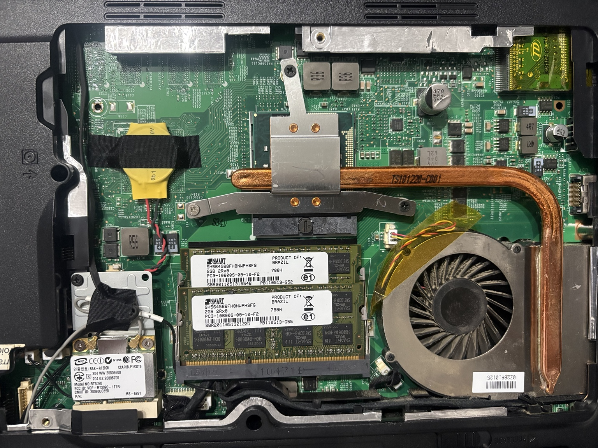

# mero-msi — CR420 MX / MS-1454 hardware notebook

Personal repair, reverse-engineering and Linux compatibility notebook for an approximately 2010 **MSI CR420 MX** (bottom-label chassis **MS-1454**) running **Linux Mint**. This repository archives photos, a user-provided MS-14531/MS-14541 boardview, test procedures, research citations and open investigations.

> **State, 2026-10-07:** The CPU overheating repair is successful; the built-in Bluetooth device remains missing from USB detection despite extensive Linux investigation; webcam investigation is next. **Do not assume that the Bluetooth radio has been physically located, or that J30 and CON17 are identical.**



## Device at a glance

| Attribute | Recorded information |
| --- | --- |
| Commercial model / chassis | **MSI CR420 MX / MS-1454**, from the underside label |
| CPU | Intel **Core i5-480M**, dual die/package, removable PGA CPU; visible package marking |
| Chipset | Intel **HM55** (MSI model specification) |
| RAM | Two **2 GB DDR3-1066 SO-DIMMs** (4 GB installed) photographed; Samsung/SMART branded |
| Wi-Fi | **Ralink RT3090** WLAN-only mini card, MSI **MS-6891**, FCC **VQF-RT3090-1T1R** |
| Cooling | Single heatpipe, centrifugal SUNON blower / fin-stack exhaust |
| Storage | 2.5-inch SATA bay on left in reference layout; installed drive model not yet documented |
| Display / webcam | MSI lists 14-inch 1366 × 768 and 1.3 MP webcam for this model series; camera not yet tested |
| Operating system | Linux Mint currently; Bluetooth reportedly worked previously under EndeavourOS/Arch |
| Original adapter | Bottom label: **19 V DC, 3.42 A** (about 65 W) |

## Repairs and investigations

- [Cooling repair — confirmed success](docs/cooling-repair.md): previously about **95 °C**, high fan RPM; after cleaning/repaste about **52–56 °C** during low activity and **below 70 °C** reported during YouTube plus btop. Fan now predominantly quiet.
- [Bluetooth hardware investigation — unresolved](docs/bluetooth-investigation.md): controller fails to enumerate as a USB device; LED/EC can still toggle; Wi-Fi card is *not* the Bluetooth module.
- [Boardview and connector map](docs/boardview-notes.md): J30 schematic discrepancy; **CON17 appears unpopulated** in real photos; do not confuse the nearby tall connector with the CON17 footprint.
- [Webcam experiment](docs/webcam-plan.md): **Fn+F6** per the MS-1454 manual; Linux V4L2/USB diagnostics ready to run.
- [Photo index](docs/photo-index.md), [evidence timeline](docs/timeline.md), [hardware inventory](docs/hardware-inventory.md), [reference links](docs/sources.md).

## Hardware research organization

```text
assets/photos/           original conversation hardware photos (public-safe underside photo)
assets/annotated/        historical marking overlays; check their status before relying on them
assets/inspection-crops/ zooms and inspection crops
boardview/               uploaded MSI MS-14531_MS-14541 ZIP and extracted BRD
docs/                    researched facts, unknowns, chronology, source links
scripts/                 READ-ONLY diagnostic collectors for Linux Mint
```

## Safe next steps

1. **No more speculative Linux fixes:** keep the previous exhaustive Bluetooth software investigation as context. Capture any existing agent logs before duplicating tests.
2. **Do not remove the motherboard solely to chase a guess:** obtain a reliable BT-module board location from the boardview/schematic or inspect accessible cables first.
3. Investigate the **webcam with Fn+F6** and `v4l2-ctl`/`lsusb`.
4. Only later consider compatible Mini PCIe Wi-Fi+Bluetooth card or a low-profile USB dongle as a *workaround*, not as proof that the original module failed.

### Evidence policy

The files include early **incorrect or unproven markings**: keep them as history, never silently promote them to verified placements. Mark claims as *confirmed from observed photos*, *documented by a manual/schematic*, *inferred from a specific boardview revision*, or *unverified hypothesis*.

### Privacy and provenance

The photo of the bottom sticker is **sanitized** because it originally exposed a Windows 7 activation key and identifying barcodes. Do not commit unredacted licence keys or private device identifiers. Boardview ZIP was supplied by the laptop owner; third-party material rights have not been verified. External manuals and schematics are **linked**, not re-hosted.

See [sources](docs/sources.md) before making modifications based on a reference-board photograph; MS-1452 and MS-14531 are **not interchangeable revisions** just because they look similar.
