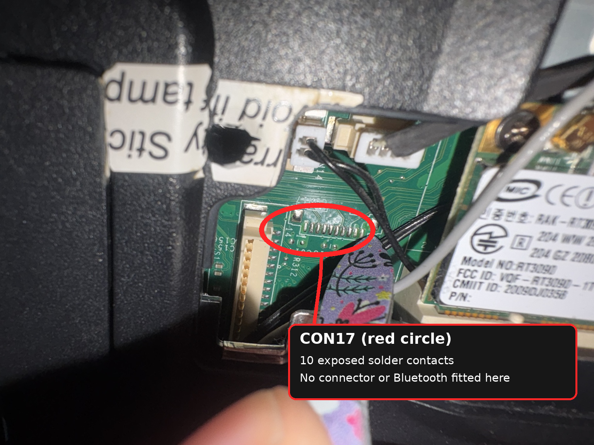

# Bluetooth device missing — evidence and decision tree

## Status: UNRESOLVED (2026-10-07)

Bluetooth reportedly **worked on EndeavourOS/Arch** before Linux Mint. Now the Bluetooth radio **does not appear as a USB device** in diagnostics according to the owner, after extensive automated and manual software attempts. Its MSI `Fn+F9` indicator can still light. Because logs have not been provided here, this remains a high-confidence owner observation, **not a saved complete diagnostic log**. Do not reboot into a chain of repetitive reinstalls as the default first action.

## Hardware identifications

- **RT3090 / MSI MS-6891** = Wi-Fi only; no Bluetooth within this labelled card.
- Separate Bluetooth module is documented on some MSI reference designs as **MS-3801 / BSMAN1** with an 8-pin `J30` connector, `BT_PWR_ON`, `USB_PN2`, `USB_PP2` and 3.3 V rails. The **exact location on this production MS-1454 board has NOT been confirmed**.
- Comparison **MS-1452** board photo used earlier was the *wrong revision* and lists Bluetooth header `CN22` in its own schematic. Do not transplant its header designations onto MS-1454.
- Uploaded **MS-14531/MS-14541 BRD** contains BT-related signals, but **no `J30` component entry** in a previous extraction. This discrepancy can reflect differing board variants and needs investigation with a proper boardview reader.
- **CON17** located beside the tall cream-coloured connector (`CON11`, likely diagnostic/LPC) near Wi-Fi: **10 surface-mount pads, footprint visibly unpopulated**. Those pads are not a functioning Bluetooth adapter. Their prior pin association includes `BT_PWR_ON`, USB pairs `PP2/PN2` and `PP12/PN12`, `WLAN_PWRON`, `+3VRUN`, and `GND` (from previous boardview tracing; revalidate pin numbers before probing).
- **J29** by Wi-Fi region = speaker wiring; nearby white 2-pin connectors = audio/microphone wiring. **CON12** by fan/RAM = camera/LED-related connector per referenced schematic. None is established as J30.

## What we can—and cannot—conclude

The working status LED proves that some embedded-controller operation responds, **not** the module's presence, +3 V rail, USB D+/D− line continuity, correct host configuration, or live Bluetooth firmware. A USB-radio absence suggests upstream hardware/power/control/connection, but can also reflect disabled USB power or chipset initialization.

## Best remaining hardware-path test

1. Preserve any prior `lsusb`, `rfkill`, `journalctl`, `dmesg`, and kernel-version results in `evidence/` once retrieved. The owner already ran extensive software diagnosis.
2. Use a proper boardview reader on the included `.brd`, trace the **Bluetooth enable and USB data nets**, and determine every endpoint, fitted vs unpopulated. **Mark exact revision first.**
3. Without motherboard extraction, inspect accessible camera/communications cables only when *their PCB designators and functions* are known; **do not reseat or energize unknown headers blindly**.
4. If safe and appropriate later: measure only **known** voltage/ground test points with an ESD-safe meter and an accurate schematic. Do not probe USB signals with a multimeter expecting to prove enumeration.
5. Alternative: an external USB Bluetooth dongle (non-invasive); or explore Half Mini PCIe combo radio after verifying **USB power/data availability and BIOS/EC compatibility**. A replacement is a workaround, **not evidence of original module failure**.

## Earlier false leads — retained as audit trail

- Initially suspected a white header under the Wi-Fi card: **unconfirmed and later disfavored**.
- Initially described SD card reader daughterboard as unknown; owner corrected it to SD reader.
- Previously circled a `J30?` candidate from appearance: **not proof**. See historical files in `assets/annotated/`.
- Mistook the long cream-coloured socket for BT; actual BT-related CON17 is *the empty solder row beside it*, **not** the tall cream connector.
- A claimed exact J30 physical placement was never established; **do not dismantle the system based on that location**.
